# 🔄 Workflows de Desarrollo - Trivance Platform

## 🎯 Metodología de Desarrollo

Trivance Platform utiliza una metodología **AI-First** combinada con **Agile/Scrum** adaptado para equipos de desarrollo moderno.

## 📅 Ceremonias del Equipo

### Daily Standup (9:00 AM)
**Duración**: 15 minutos  
**Participantes**: Todo el equipo dev  
**Formato**:
- ✅ ¿Qué hice ayer?
- 🎯 ¿Qué haré hoy?
- 🚧 ¿Hay bloqueos?

### Sprint Planning (Bi-semanal)
**Duración**: 2 horas  
**Objetivos**:
- Planificar trabajo del sprint
- Estimar esfuerzo de tareas
- Definir criterios de aceptación

### Sprint Review & Retrospective
**Duración**: 1.5 horas  
**Objetivos**:
- Demo de funcionalidades completadas
- Identificar mejoras de proceso
- Actualizar backlog

## 🚀 Workflow de Desarrollo

### 1. Flujo de Trabajo Estándar (Con Verificación de Compilación)

```mermaid
graph LR
    A[Tarea Asignada] --> B[Crear Branch]
    B --> C[Desarrollo Local]
    C --> D[Verificar Compilación]
    D --> E[Tests + Lint]
    E --> F[Commit + Push]
    F --> G[Pull Request]
    G --> H[Code Review + CI]
    H --> I[Merge a Develop]
    I --> J[Deploy QA]
    J --> K[Testing QA]
    K --> L[Merge a Main]
    L --> M[Deploy Producción]
```



### 📝 NUEVO: Paso Obligatorio de Verificación

**Antes de cualquier commit**, SIEMPRE ejecutar:

```bash
# OBLIGATORIO: Verificar que todos los repos compilen
./scripts/verify-compilation.sh

# Solo si pasa la verificación, proceder con commit
git add .
git commit -m "feat: descripción del cambio"
```

### 2. Convenciones de Branches

#### Naming Convention
```bash
# Feature branches
feat/TKTX-description-corta

# Bug fixes
fix/TKTX-description-del-bug

# Hotfixes críticos
hotfix/TKTX-descripcion-critica

# Releases
release/v1.2.0
```

#### Ejemplos
```bash
feat/TKT123-dashboard-analytics
fix/TKT456-auth-token-expiry
hotfix/TKT789-payment-gateway-down
```

### 3. Flujo Multi-Repo

#### Sincronización de Cambios
```bash
# 1. Crear feature branch en repo correspondiente
git checkout -b feat/TKT123-nueva-funcionalidad

# 2. Desarrollar funcionalidad
# Backend changes en ms_level_up_management
# Frontend changes en level_up_backoffice
# Mobile changes en trivance-mobile (si aplica)

# 3. OBLIGATORIO: Verificar compilación antes de commit
./scripts/verify-compilation.sh

# 4. Solo si compila correctamente, hacer commits atómicos
git add .
git commit -m "feat(backend): agregar endpoint de analytics

- Agregar controller de analytics
- Agregar service con queries MongoDB
- Agregar DTOs de request/response
- Agregar tests unitarios
- ✅ Verificado: todos los repos compilan correctamente

Refs: TKT123"

# 5. Push y crear PR en cada repo afectado
git push origin feat/TKT123-nueva-funcionalidad
```

## 📝 Estándares de Commits

### Conventional Commits
```bash
# Formato
<tipo>(<scope>): <descripción>

<cuerpo detallado>

<footer>
```

### Tipos Permitidos
- **feat**: Nueva funcionalidad
- **fix**: Corrección de bug
- **docs**: Cambios en documentación
- **style**: Cambios de formato (no afectan lógica)
- **refactor**: Refactorización de código
- **test**: Agregar o modificar tests
- **chore**: Tareas de mantenimiento
- **perf**: Mejoras de performance
- **ci**: Cambios en CI/CD

### Scopes Comunes
- **backend**: Cambios en APIs/servicios
- **frontend**: Cambios en interfaz web
- **mobile**: Cambios en app móvil
- **shared**: Cambios que afectan múltiples componentes
- **config**: Cambios en configuración
- **deps**: Cambios en dependencias

### Ejemplos de Buenos Commits
```bash
feat(backend): agregar sistema de notificaciones push

- Implementar NotificationService con Firebase
- Agregar endpoints para envío y historial
- Configurar templates de notificaciones
- Agregar tests de integración

Refs: TKT123
Closes: #456

fix(frontend): corregir validación de formulario de registro

- Agregar validación de email en tiempo real
- Corregir mensaje de error en contraseña
- Mejorar UX con mejor feedback visual

Refs: TKT789

docs(shared): actualizar README con nuevos comandos

- Agregar sección de troubleshooting
- Documentar nuevos scripts de automatización
- Actualizar diagramas de arquitectura
```

## 🔍 Proceso de Code Review

### Checklist para Autor del PR

#### Antes de Crear PR
- [ ] **Funcionalidad completa** según criterios de aceptación
- [ ] **Tests escritos** y pasando
- [ ] **Linting limpio** (`npm run lint`)
- [ ] **Build exitoso** (`npm run build`)
- [ ] **Documentación actualizada** si es necesario
- [ ] **Screenshots/GIFs** para cambios de UI

#### Descripción del PR
```markdown
## 📋 Resumen
Breve descripción de los cambios implementados.

## 🎯 Motivación
¿Por qué es necesario este cambio?

## 🔄 Cambios Realizados
- [ ] Cambio 1
- [ ] Cambio 2
- [ ] Cambio 3

## 🧪 Testing
- [ ] Tests unitarios agregados/actualizados
- [ ] Tests de integración verificados
- [ ] Testing manual completado

## 📱 Screenshots/GIFs
(Para cambios de UI)

## 🔗 Enlaces Relacionados
- Jira: TKT123
- Diseño: Figma link
- Documentación: Link relevante
```

### Checklist para Reviewer

#### Aspectos Técnicos
- [ ] **Arquitectura** sigue patrones establecidos
- [ ] **Performance** no se degrada
- [ ] **Seguridad** no hay vulnerabilidades
- [ ] **Mantenibilidad** código limpio y legible
- [ ] **Tests** cubren casos importantes
- [ ] **Documentación** actualizada apropiadamente

#### Aspectos de Negocio
- [ ] **Funcionalidad** cumple requerimientos
- [ ] **UX** es intuitiva y consistente
- [ ] **Edge cases** considerados
- [ ] **Backward compatibility** mantenida

### Proceso de Review
1. **Auto-asignación** o asignación por tech lead
2. **Review en 24 horas** máximo
3. **Comentarios constructivos** con sugerencias
4. **Aprovación requerida** de al menos 1 reviewer
5. **Address comments** antes del merge

## 🚀 Deployment y Releases

### Ambientes de Deployment

#### Development
- **Trigger**: Push a cualquier branch
- **Propósito**: Testing local y features en desarrollo
- **URL**: http://localhost:*

#### QA/Staging
- **Trigger**: Merge a `develop` branch
- **Propósito**: Testing de integración y validación QA
- **URLs**:
  - Auth: https://authqa.trivance.com
  - API: https://apiqa.trivance.com
  - Frontend: https://staging-admin.trivance.com

#### Production
- **Trigger**: Merge a `main` branch (con aprobación)
- **Propósito**: Ambiente de producción
- **URLs**:
  - Auth: https://auth.example.com
  - API: https://api.example.com
  - Frontend: https://admin.example.com

### Proceso de Release

#### 1. Preparación de Release
```bash
# 1. Crear branch de release
git checkout develop
git pull origin develop
git checkout -b release/v1.2.0

# 2. Actualizar versiones
# Actualizar package.json en cada repo
# Actualizar CHANGELOG.md
# Actualizar documentación

# 3. Testing final
./scripts/test-all.sh
./scripts/lint-all.sh

# 4. Crear PR de release a main
```

#### 2. Deploy a Producción
```bash
# Después de merge a main
# 1. Deploy automático vía CI/CD
# 2. Verificar health checks
# 3. Smoke testing en producción
# 4. Notificar al equipo

# 5. Crear tag de release
git tag -a v1.2.0 -m "Release v1.2.0: Nueva funcionalidad de analytics"
git push origin v1.2.0
```

### Rollback Strategy
```bash
# En caso de problemas en producción
# 1. Rollback inmediato a versión anterior
git revert <commit-hash>

# 2. Hotfix si es necesario
git checkout -b hotfix/fix-critical-issue
# Implementar fix
# Fast-track review y deploy
```

## 🧪 Testing Strategy

### Pirámide de Testing

#### Unit Tests (70%)
```bash
# Para cada repositorio
cd repo-name
npm test

# Con coverage
npm run test:cov
```

#### Integration Tests (20%)
```bash
# Tests de API endpoints
npm run test:e2e

# Tests de integración entre servicios
```

#### E2E Tests (10%)
```bash
# Tests de flujos completos de usuario
# Usando Cypress o Playwright
npm run test:e2e:full
```

### Testing por Tipo de Cambio

#### Features Nuevas
- [ ] Unit tests para nueva lógica
- [ ] Integration tests para nuevos endpoints
- [ ] Component tests para nueva UI
- [ ] E2E test para flujo completo

#### Bug Fixes
- [ ] Test que reproduce el bug
- [ ] Verificar que el test falla antes del fix
- [ ] Verificar que el test pasa después del fix

#### Refactoring
- [ ] Todos los tests existentes siguen pasando
- [ ] Coverage no se reduce
- [ ] Performance no se degrada

## 🔧 Herramientas de Desarrollo

### AI-First Development

#### Claude Code Workflow
```bash
# 1. Usar prompts predefinidos
# Ver .claude/prompts.md para prompts específicos

# 2. Contexto automático
# Claude Code lee automáticamente .claude/context.md

# 3. Comandos rápidos
# Usar .claude/commands.md para comandos frecuentes
```

#### Cursor Workflow
```bash
# 1. Usar reglas específicas (.cursorrules)
# 2. Contexto del proyecto automático
# 3. Sugerencias basadas en patrones existentes
```

### Scripts de Automatización

#### Desarrollo Diario
```bash
./scripts/start-all-services.sh      # Iniciar workspace
./scripts/check-health.sh            # Verificar estado
./scripts/sync-configs.sh            # Actualizar configuraciones
./scripts/stop-all-services.sh       # Detener workspace
```

#### Testing y Quality
```bash
./scripts/test-all.sh                # Tests en todos los repos
./scripts/lint-all.sh                # Linting en todos los repos
./scripts/build-all.sh               # Build de todos los repos
```

### Monitoring y Debugging

#### Local Development
```bash
# Ver logs de servicios
tail -f logs/Management\ API.log
tail -f logs/Auth\ Service.log
tail -f logs/Frontend.log

# Debug con herramientas del navegador
# React DevTools, Apollo DevTools, Redux DevTools
```

#### QA/Production
- **Sentry**: Error tracking y performance monitoring
- **Logs**: Estructurados con niveles apropiados
- **Health Checks**: Endpoints `/health` en cada servicio
- **Metrics**: Métricas de negocio y técnicas

## 📊 Métricas y KPIs

### Métricas de Desarrollo
- **Lead Time**: Tiempo desde asignación hasta deploy
- **Cycle Time**: Tiempo desde primer commit hasta deploy
- **Deployment Frequency**: Frecuencia de deploys
- **Mean Time to Recovery**: Tiempo de recuperación de issues

### Métricas de Calidad
- **Code Coverage**: >80% en componentes críticos
- **Bug Rate**: Bugs encontrados por feature
- **Performance**: Tiempo de respuesta de APIs
- **Uptime**: Disponibilidad de servicios

## 🚨 Incident Response

### Severidad de Incidents

#### Critical (P0)
- **Definición**: Sistema completamente caído
- **Respuesta**: Inmediata (< 15 minutos)
- **Comunicación**: Slack + Email + Phone

#### High (P1)
- **Definición**: Funcionalidad crítica afectada
- **Respuesta**: < 1 hora
- **Comunicación**: Slack + Email

#### Medium (P2)
- **Definición**: Funcionalidad no crítica afectada
- **Respuesta**: < 4 horas
- **Comunicación**: Slack

#### Low (P3)
- **Definición**: Issues menores o mejoras
- **Respuesta**: Próximo sprint
- **Comunicación**: Jira

### Proceso de Incident Response
1. **Detección** (monitoring, alertas, reportes)
2. **Triage** (clasificar severidad)
3. **Investigación** (logs, métricas, debugging)
4. **Mitigación** (rollback, hotfix, workaround)
5. **Resolución** (fix definitivo)
6. **Post-mortem** (análisis y mejoras)

## 📚 Documentación y Knowledge Sharing

### Documentación Requerida
- **ADRs** (Architecture Decision Records)
- **API Documentation** (OpenAPI/GraphQL schemas)
- **Runbooks** (operational procedures)
- **Troubleshooting Guides**

### Knowledge Sharing
- **Tech Talks** (sesiones semanales)
- **Code Reviews** (aprendizaje continuo)
- **Pair Programming** (para features complejas)
- **Documentation** (wiki interno)

## 🎯 Mejores Prácticas

### Performance
- **Lazy Loading** para componentes pesados
- **Memoization** para cálculos costosos
- **Database Indexing** para queries frecuentes
- **Caching** estratégico (Redis, CDN)

### Security
- **Input Validation** en todas las capas
- **Output Sanitization** 
- **HTTPS** en todos los ambientes
- **Rate Limiting** en APIs públicas
- **Regular Security Audits**

### Maintainability
- **Clear Naming** conventions
- **Small Functions** (single responsibility)
- **Consistent Patterns** across codebase
- **Regular Refactoring**
- **Technical Debt Management**

---

Este documento está vivo y se actualiza regularmente basado en la evolución del equipo y las mejores prácticas de la industria.