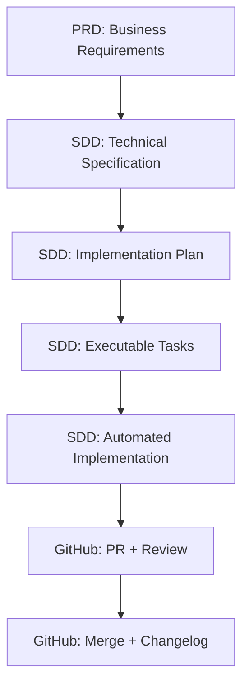

# Workflow AI-First

_Guía completa del ecosistema PRD → SDD → GitHub_

---

## 🎯 Arquitectura del Ecosistema

El ecosistema está diseñado en 3 capas integradas:

```
📋 PRD-cycle (Business Layer)
   ↓ Define WHAT to build
🏗️ SDD-cycle (Engineering Layer)
   ↓ Define HOW to build
🔄 git-github (Delivery Layer)
   ↓ Tracks and delivers
```

### Flujo Completo



---

## 📦 Setup Inicial (OBLIGATORIO)

### Configuración de Workspace

**Desde main/develop**:

```bash
# 1. Iniciar sesión
/utils:session-start

# 2. Crear worktree aislado
/git-github:worktree:create "feature-oauth" develop

# 3. Cambiar al worktree
cd ../worktree-feature-oauth

# 4. Nueva sesión en worktree
/utils:session-start
```

**Validación - estás listo cuando**:

```bash
git branch    # Muestra: * feature-oauth (NO main/develop)
pwd           # Muestra: .../worktree-feature-oauth
```

---

## 🔄 Ciclo Completo: PRD → SDD → GitHub

### OPCIÓN A: Desde Requisitos de Negocio (PRD)

Para features nuevas que requieren planificación de negocio:

```bash
# === FASE 1: PRD (Business Layer) ===
/PRD-cycle:prd-new <feature_name>
# → Brainstorming completo
# → Crea PRD estructurado en .claude/prds/<feature>/prd.md

# Optimizar PRD para SDD
/PRD-cycle:prd-parse <feature_name>
# → Pre-resuelve ambigüedades
# → Genera sdd-input.md optimizado

# Sincronizar a GitHub (opcional)
/git-github:prd-sync <feature_name>
# → Crea parent issue en GitHub
# → Trackea progreso de negocio

# === FASE 2: SDD (Engineering Layer) ===
/SDD-cycle:specify --from-issue <issue_number>
# O usar sdd-input.md:
/SDD-cycle:specify "$(cat .claude/prds/<feature>/sdd-input.md)"
# → Crea especificación técnica
# → Genera branch automáticamente
# → Crea spec.md

/SDD-cycle:clarify
# → Detecta ambigüedades (5 preguntas max)
# → Actualiza spec con respuestas
# → CRÍTICO: reduce rework 70%

/SDD-cycle:plan
# → Genera artifacts de diseño
# → research.md, data-model.md, contracts/, quickstart.md

/SDD-cycle:tasks
# → Genera tasks.md con dependency order
# → Marca tareas paralelas [P]
# → Crea GitHub sub-issues si hay parent

/SDD-cycle:analyze
# → Validación cross-artifact
# → Detección de inconsistencias
# → Plan de coordinación

/SDD-cycle:implement
# → Ejecución automática de tasks.md
# → Parallelization inteligente
# → TDD enforcement
# → Validation checkpoints

# === FASE 3: GitHub Integration ===
/git-github:commit "all changes"
# → Commits semánticos agrupados

/git-github:pr develop
# → Security review BLOCKING
# → Crea PR con metadata completa
# → Returns PR URL
```

### OPCIÓN B: Desarrollo Directo (Sin PRD)

Para features técnicas o bug fixes que no requieren PRD:

```bash
# === FASE 1: SDD (Engineering Layer) ===
/utils:understand
# → Mapea arquitectura existente
# → Identifica patrones y convenciones

/SDD-cycle:specify "Implement OAuth authentication"
# → Crea especificación técnica directamente
# → Branch automático + spec.md

# Continuar con ciclo SDD completo
/SDD-cycle:clarify
/SDD-cycle:plan
/SDD-cycle:tasks
/SDD-cycle:analyze
/SDD-cycle:implement

# === FASE 2: GitHub Integration ===
/git-github:commit "all changes"
/git-github:pr develop
```

---

## 🔍 Análisis y Resolución de Findings

### Después del PR

El PR ejecuta security review automático. Tipos de findings:

- **CRITICAL**: Security vulnerabilities, architectural violations
- **HIGH**: Technical debt, missing error handling
- **MEDIUM**: Code quality, optimization opportunities
- **LOW**: Style improvements, documentation

### Workflow de Resolución

```bash
# 1. Analizar findings y generar plan
/git-github:issue-manager <pr_number>
# → Análisis detallado del issue/PR
# → Complejidad estimada
# → Archivos afectados
# → Próximos pasos sugeridos

# 2. Resolver findings
# Opción A: Manual
# Opción B: Delegar a especialista (ver sección Agentes)

# 3. Actualizar PR
/git-github:commit "fix: resolve security findings"
git push

# 4. Validar resolución
# GitHub re-ejecuta security review automáticamente
```

---

## 🤖 Cuándo Usar Agentes Especialistas

**📖 Referencia completa**: Ver @human-handbook/docs/agents-guide.md para los 44 agentes especializados.

Los agentes aceleran resolución de findings complejos:

### Agentes Core (Quality Gates)

```bash
# Security findings
/agent:security-reviewer
# → Auditoría completa de seguridad
# → Detección de vulnerabilidades

# Performance issues
/agent:performance-engineer
# → Optimización de bottlenecks
# → Análisis de recursos

# Code quality
/agent:code-quality-reviewer
# → Review de principios universales
# → Prevención de deuda técnica

# Architecture integrity
/agent:architect-reviewer
# → Validación de patrones arquitectónicos
# → Review de diseño
```

### Agentes de Implementación

```bash
# Backend
/agent:backend-architect
# → Diseño de APIs y servicios

# Frontend
/agent:frontend-developer
# → Componentes React/Vue
# → State management

# Database
/agent:database-optimizer
# → Query optimization
# → Schema design

# Testing
/agent:test-automator
# → Test automation strategy
# → CI/CD integration
```

**Tip**: Los agentes se usan SOLO cuando findings son complejos o requieren expertise especializado.

---

## 🔄 Post-Merge: Cleanup y Documentación

Después de aprobar y mergear el PR:

```bash
# 1. Actualizar CHANGELOG
/utils:changelog <pr_number>
# → Auto-detecta PRs faltantes
# → Actualiza CHANGELOG.md
# → Keep a Changelog format

# 2. Limpiar worktree
/git-github:worktree:cleanup worktree-feature-oauth
# → Validación de ownership
# → Triple cleanup (worktree/local/remote)
# → Regresa automáticamente a main

# 3. Actualizar documentación (si necesario)
/utils:docs
# → Analiza docs existentes
# → Actualiza README, API docs, etc.
```

---

## 📊 Flujos Resumidos por Caso de Uso

### Feature Nueva con PRD

```bash
# Business Planning
/PRD-cycle:prd-new feature-name
/PRD-cycle:prd-parse feature-name
/git-github:prd-sync feature-name

# Engineering Implementation
/SDD-cycle:specify --from-issue <number>
/SDD-cycle:clarify
/SDD-cycle:plan
/SDD-cycle:tasks
/SDD-cycle:analyze
/SDD-cycle:implement

# Delivery
/git-github:commit "all changes"
/git-github:pr develop

# Post-Merge
/utils:changelog <pr_number>
/git-github:worktree:cleanup <worktree>
```

### Feature Técnica (Sin PRD)

```bash
# Engineering Direct
/utils:understand
/SDD-cycle:specify "feature description"
/SDD-cycle:clarify
/SDD-cycle:plan
/SDD-cycle:tasks
/SDD-cycle:analyze
/SDD-cycle:implement

# Delivery
/git-github:commit "all changes"
/git-github:pr develop

# Post-Merge
/utils:changelog <pr_number>
/git-github:worktree:cleanup <worktree>
```

### Bug Fix Urgente

```bash
# Setup
/git-github:worktree:create fix-bug main
cd ../worktree-fix-bug

# Implementation
/utils:understand "specific problem"
/SDD-cycle:specify "fix bug description"
/SDD-cycle:clarify
/SDD-cycle:plan
/SDD-cycle:tasks
/SDD-cycle:analyze
/SDD-cycle:implement

# Delivery
/git-github:commit "fix: description"
/git-github:pr main
```

---

## 🎯 Comandos Esenciales por Contexto

### Desde main/develop

```bash
/utils:session-start                    # Análisis + issues activos
/git-github:worktree:create <purpose> <parent-branch>
```

### Desde worktree (desarrollo activo)

```bash
/utils:understand                       # Context mapping
/SDD-cycle:specify "feature"            # Inicia ciclo SDD
/SDD-cycle:clarify                      # Reduce rework 70%
/SDD-cycle:implement                    # Motor de implementación
/git-github:commit "message"            # Commit semántico
/git-github:pr <target-branch>          # Crear PR
```

### Resolución de Findings

```bash
/git-github:issue-manager <number>      # Analizar findings
/agent:security-reviewer                # Security audit
/agent:performance-engineer             # Performance optimization
```

### Post-Merge

```bash
/utils:changelog <pr_number>            # Actualizar changelog
/git-github:worktree:cleanup <name>     # Cleanup completo
```

---

## 💡 Tips y Buenas Prácticas

### DO (Hacer)

- ✅ Usar `/SDD-cycle:clarify` SIEMPRE (reduce rework 70%)
- ✅ Ejecutar security review antes de PR (`/git-github:pr` lo hace automático)
- ✅ Mantener un PR por worktree
- ✅ Usar commits semánticos con referencias: `fix: Closes #77`
- ✅ Limpiar worktrees después de merge

### DON'T (No Hacer)

- ❌ Saltarse `/SDD-cycle:clarify` (causa rework masivo)
- ❌ Crear múltiples PRs para una feature
- ❌ Desarrollar en main/develop directamente
- ❌ Mergear sin security review aprobado
- ❌ Dejar worktrees sin cleanup

### Selección de Path

**¿Cuándo usar PRD-cycle?**

- Features nuevas con stakeholders de negocio
- Cambios que requieren aprobación de producto
- Features complejas con múltiples epics

**¿Cuándo ir directo a SDD-cycle?**

- Bug fixes técnicos
- Refactorings internos
- Features puramente técnicas
- Mejoras de performance

---

## 🔗 Integración con GitHub

### Sincronización de Artifacts

```bash
# PRD → GitHub Issue
/git-github:prd-sync <feature_name>
# → Crea parent issue
# → Trackea progreso de negocio

# Epic → GitHub Issue
/git-github:epic-sync <epic_name>
# → Crea parent issue para epic
# → Milestone assignment opcional

# Updates → GitHub Comments
/git-github:issue-sync <issue_number>
# → Push local updates como comments
# → Audit trail transparente
```

### Gestión de Issues

```bash
# Dashboard de issues activos
/git-github:issue-manager
# → Categorización por prioridad/age/tipo
# → Detección de issues stale
# → Estimación de complejidad

# Análisis profundo de issue específico
/git-github:issue-manager <issue_number>
# → Contexto completo
# → Archivos afectados
# → Próximos pasos sugeridos
```

---

## 📚 Referencia Rápida de Comandos

### PRD-cycle (Business Layer)

| Comando                | Propósito             |
| ---------------------- | --------------------- |
| `/PRD-cycle:prd-new`   | Crear nuevo PRD       |
| `/PRD-cycle:prd-parse` | PRD → SDD-ready input |

### SDD-cycle (Engineering Layer)

| Comando                   | Propósito                         |
| ------------------------- | --------------------------------- |
| `/SDD-cycle:specify`      | Crear especificación técnica      |
| `/SDD-cycle:clarify`      | Clarificar ambigüedades (CRÍTICO) |
| `/SDD-cycle:plan`         | Generar artifacts de diseño       |
| `/SDD-cycle:tasks`        | Generar tareas ejecutables        |
| `/SDD-cycle:analyze`      | Validación cross-artifact         |
| `/SDD-cycle:implement`    | Motor de implementación           |
| `/SDD-cycle:constitution` | Actualizar constitución           |

### git-github (Delivery Layer)

| Comando                        | Propósito                    |
| ------------------------------ | ---------------------------- |
| `/git-github:worktree:create`  | Crear worktree aislado       |
| `/git-github:worktree:cleanup` | Limpiar worktrees            |
| `/git-github:commit`           | Commits semánticos           |
| `/git-github:pr`               | Crear PR con security review |
| `/git-github:switch`           | Cambio seguro de rama        |
| `/git-github:issue-manager`    | Gestionar issues             |
| `/git-github:prd-sync`         | Sincronizar PRD              |
| `/git-github:epic-sync`        | Sincronizar epic             |
| `/git-github:issue-sync`       | Sincronizar updates          |

---

_Última actualización: 2025-10-01 | Ecosistema PRD-SDD-GitHub_
