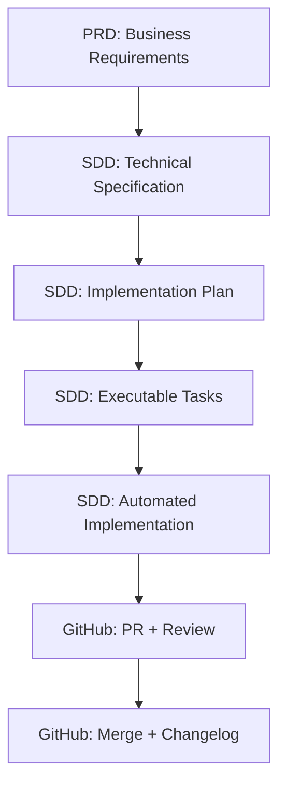

# Workflow AI-First

_Guía del ecosistema PRD → SDD → GitHub_

---

## 🎯 Arquitectura del Ecosistema

El ecosistema opera en 3 capas integradas:

```
📋 PRD-cycle (Business Layer)
   ↓ Define WHAT to build
🏗️ SDD-cycle (Engineering Layer)
   ↓ Define HOW to build
🔄 git-github (Delivery Layer)
   ↓ Tracks and delivers
```

### Flujo Completo



---

## 📦 Setup Inicial (OBLIGATORIO)

### Configuración de Workspace

**Opción A: Feature con SDD tracking** (recomendado):

```bash
# 1. Iniciar sesión desde main/develop
/utils:session-start

# 2. Crear worktree con ciclo SDD (automático)
/SDD-cycle:specify "implement OAuth authentication"
# → Crea: ../feature-001-implement-oauth/
# → Rama: 001-implement-oauth
# → Spec: specs/001-implement-oauth/spec.md
# → Abre IDE automáticamente en nueva ventana

# 3. CRÍTICO: En la nueva ventana del IDE
#    (NO en la ventana anterior de Claude)
Cmd+` (o View → Terminal) para abrir terminal integrado

# 4. Verificar directorio correcto
pwd  # DEBE mostrar: ../feature-001-implement-oauth/

# 5. Continuar workflow SDD (SECUENCIAL, OBLIGATORIO)
/SDD-cycle:clarify   # Reducir ambigüedades (NUNCA omitir)
/SDD-cycle:plan      # Genera plan.md + tasks.md
/SDD-cycle:analyze   # Valida consistencia
/SDD-cycle:implement # Ejecuta implementación
```

**Opción B: Trabajo ad-hoc sin SDD** (fixes rápidos, POCs):

```bash
# 1. Iniciar sesión desde main/develop
/utils:session-start

# 2. Crear worktree aislado
/git-github:worktree:create "fix-payment-bug" main
# → Crea: ../worktree-fix-payment-bug/
# → Abre IDE automáticamente en nueva ventana

# 3. CRÍTICO: En la nueva ventana del IDE
Cmd+` para abrir terminal integrado

# 4. Verificar directorio correcto
pwd  # DEBE mostrar: ../worktree-fix-payment-bug/

# 5. Iniciar sesión Claude en worktree
/utils:session-start
```

**Validación - estás listo cuando**:

```bash
git branch    # Muestra rama numerada o worktree-* (NO main/develop)
pwd           # Muestra directorio del worktree (NO repo principal)
```

### ⚠️ Comportamiento según Contexto

**Desde main/develop (repo principal)**:

- `/SDD-cycle:specify "feature X"` → Crea nuevo worktree en `../feature-001-feature-x/`
- Worktree incluye nueva rama `001-feature-x`
- Specs creados en `../feature-001-feature-x/specs/`

**Desde worktree existente**:

- `/SDD-cycle:specify "sub-feature Y"` → **NO crea nuevo worktree**
- Usa la rama actual del worktree donde estás trabajando
- Specs creados en directorio actual: `./specs/002-sub-feature-y/`
- IDE **NO se reabre** (ya estás en el directorio correcto)
- Siguiente paso: `/SDD-cycle:clarify` (OBLIGATORIO, sin verificación de directorio)

**⚠️ Para feature INDEPENDIENTE (nueva rama):**

- Regresa a `main` primero: `cd` al repo principal
- Ejecuta `/SDD-cycle:specify` desde allí
- Esto creará nuevo worktree con nueva rama

**Desde subdirectorio** (ej: `/src/components/`):

- El script detecta automáticamente el repo root
- Comportamiento igual que ejecutar desde root

### ⚠️ Advertencia Crítica: Verificación de Directorio

**PROBLEMA COMÚN:** Claude trabaja en el directorio equivocado

**SÍNTOMAS:**

- Los archivos se crean en el repo principal en lugar del worktree
- Los cambios afectan la rama `main` en lugar de la rama de feature
- El comando `git status` muestra archivos inesperados

**SOLUCIÓN:**
Después de que el IDE se abra automáticamente:

1. **Abrir terminal integrado en la NUEVA ventana del IDE**
   - Cmd+` (macOS) o Ctrl+` (Linux/Windows)
   - NO reutilizar terminal de la ventana anterior

2. **Verificar directorio**

   ```bash
   pwd
   # Debe mostrar: ../feature-XXX-nombre/ o ../worktree-nombre/
   # NO debe mostrar: el directorio del repo principal
   ```

3. **Si el directorio es incorrecto:**

   ```bash
   # Opción A: Navegar manualmente
   cd ../feature-XXX-nombre/

   # Opción B: Cerrar ventana y abrir correctamente
   code ../feature-XXX-nombre --new-window
   ```

**Por qué es importante:** El directorio correcto garantiza que todos los comandos SDD funcionen sobre el worktree aislado, no sobre el repo principal.

---

## 🔄 Ciclo Completo: PRD → SDD → GitHub

### OPCIÓN A: Desde Requisitos de Negocio (PRD)

Para features nuevas que requieren planificación de negocio:

```bash
# === FASE 1: PRD (Business Layer) ===
/PRD-cycle:prd-new <feature_name>
# → Brainstorming completo
# → Crea PRD minimalista (50-100 líneas) en .claude/prds/<feature>/prd.md

# Sincronizar a GitHub
/PRD-cycle:prd-sync <feature_name>
# → Crea parent issue en GitHub
# → Trackea progreso de negocio

# === FASE 2: SDD (Engineering Layer - SECUENCIAL OBLIGATORIO) ===
/SDD-cycle:specify --from-issue <issue_number>
# O usar PRD local:
/SDD-cycle:specify --from-prd <feature_name>
# → Crea especificación técnica
# → Genera branch automáticamente
# → Crea spec.md con [NEEDS CLARIFICATION] markers

/SDD-cycle:clarify
# → Detecta ambigüedades (5 preguntas max)
# → Actualiza spec con respuestas
# → OBLIGATORIO: nunca omitir este paso

/SDD-cycle:plan
# → Genera artifacts de diseño
# → research.md, data-model.md, contracts/, quickstart.md
# → IMPORTANTE: genera tasks.md automáticamente (Phase 2)

/SDD-cycle:analyze
# → Validación cross-artifact (spec.md, plan.md, tasks.md)
# → Detección de inconsistencias
# → Plan de coordinación

/SDD-cycle:implement
# → Ejecución automática de tasks.md
# → Parallelization inteligente
# → TDD enforcement
# → Validation checkpoints

# === FASE 3: GitHub Integration ===
/git-github:commit "all changes"
# → Commits semánticos agrupados

/git-github:pr develop
# → Security review BLOCKING
# → Crea PR con metadata completa
# → Returns PR URL
```

### OPCIÓN B: Desarrollo Directo (Sin PRD)

Para features técnicas o bug fixes que no requieren PRD:

```bash
# === FASE 1: SDD (Engineering Layer - SECUENCIAL OBLIGATORIO) ===
/utils:understand
# → Mapea arquitectura existente
# → Identifica patrones y convenciones

/SDD-cycle:specify "Implement OAuth authentication"
# → Crea especificación técnica directamente
# → Branch automático + spec.md

# Continuar con ciclo SDD completo (SECUENCIAL)
/SDD-cycle:clarify   # OBLIGATORIO
/SDD-cycle:plan      # Genera plan.md + tasks.md
/SDD-cycle:analyze   # Valida consistencia
/SDD-cycle:implement # Ejecuta tasks.md

# === FASE 2: GitHub Integration ===
/git-github:commit "all changes"
/git-github:pr develop
```

---

## 🔍 Análisis y Resolución de Findings

### Después del PR

El PR ejecuta security review automático. Tipos de findings:

- **CRITICAL**: Security vulnerabilities, architectural violations
- **HIGH**: Technical debt, missing error handling
- **MEDIUM**: Code quality, optimization opportunities
- **LOW**: Style improvements, documentation

### Workflow de Resolución

```bash
# 1. Analizar findings y generar plan
/git-github:issue-manager <pr_number>
# → Análisis detallado del issue/PR
# → Complejidad estimada
# → Archivos afectados
# → Próximos pasos sugeridos

# 2. Resolver findings
# Opción A: Manual
# Opción B: Delegar a especialista (ver sección Agentes)

# 3. Actualizar PR
/git-github:commit "fix: resolve security findings"
git push

# 4. Validar resolución
# GitHub re-ejecuta security review automáticamente
```

---

## 🤖 Cuándo Usar Agentes Especialistas

**📖 Referencia completa**: Ver @human-handbook/docs/agents-guide.md para los 44 agentes especializados.

Los agentes aceleran resolución de findings complejos:

### Agentes Core (Quality Gates)

```bash
# Security findings
/agent:security-reviewer
# → Auditoría completa de seguridad
# → Detección de vulnerabilidades

# Performance issues
/agent:performance-engineer
# → Optimización de bottlenecks
# → Análisis de recursos

# Code quality
/agent:code-quality-reviewer
# → Review de principios universales
# → Prevención de deuda técnica

# Architecture integrity
/agent:architect-reviewer
# → Validación de patrones arquitectónicos
# → Review de diseño
```

### Agentes de Implementación

```bash
# Backend
/agent:backend-architect
# → Diseño de APIs y servicios

# Frontend
/agent:frontend-developer
# → Componentes React/Vue
# → State management

# Database
/agent:database-optimizer
# → Query optimization
# → Schema design

# Testing
/agent:test-automator
# → Test automation strategy
# → CI/CD integration
```

**Tip**: Los agentes se usan SOLO cuando findings son complejos o requieren expertise especializado.

---

## 🔄 Post-Merge: Cleanup y Documentación

Después de aprobar y mergear el PR:

```bash
# 1. Actualizar CHANGELOG
/utils:changelog <pr_number>
# → Auto-detecta PRs faltantes
# → Actualiza CHANGELOG.md
# → Keep a Changelog format

# 2. Limpiar worktree
/git-github:worktree:cleanup feature-001-implement-oauth
# → Validación de ownership
# → Triple cleanup (worktree/local/remote)
# → Regresa automáticamente a main
# Nota: Funciona con cualquier worktree (SDD o ad-hoc)

# 3. Actualizar documentación (si necesario)
/utils:docs
# → Analiza docs existentes
# → Actualiza README, API docs, etc.
```

---

## 📊 Flujos Resumidos por Caso de Uso

### Feature Nueva con PRD

```bash
# Business Planning
/PRD-cycle:prd-new feature-name
/PRD-cycle:prd-sync feature-name

# Engineering Implementation (SECUENCIAL)
/SDD-cycle:specify --from-issue <number>
/SDD-cycle:clarify
/SDD-cycle:plan
/SDD-cycle:analyze
/SDD-cycle:implement

# Delivery
/git-github:commit "all changes"
/git-github:pr develop

# Post-Merge
/utils:changelog <pr_number>
/git-github:worktree:cleanup <worktree>
```

### Feature Técnica (Sin PRD)

```bash
# Engineering Direct (SECUENCIAL)
/utils:understand
/SDD-cycle:specify "feature description"
/SDD-cycle:clarify
/SDD-cycle:plan
/SDD-cycle:analyze
/SDD-cycle:implement

# Delivery
/git-github:commit "all changes"
/git-github:pr develop

# Post-Merge
/utils:changelog <pr_number>
/git-github:worktree:cleanup <worktree>
```

### Bug Fix Urgente

```bash
# Setup
/git-github:worktree:create fix-bug main
# → Abre IDE automáticamente en nueva ventana

# En la nueva ventana del IDE: Abrir terminal (Cmd+`)
# Verificar: pwd debe mostrar ../worktree-fix-bug/

# Implementation (SECUENCIAL)
/utils:understand "specific problem"
/SDD-cycle:specify "fix bug description"
/SDD-cycle:clarify
/SDD-cycle:plan
/SDD-cycle:analyze
/SDD-cycle:implement

# Delivery
/git-github:commit "fix: description"
/git-github:pr main
```

---

## 🎯 Comandos Esenciales por Contexto

### Desde main/develop

```bash
/utils:session-start                    # Análisis + issues activos
/SDD-cycle:specify "feature"            # Crear worktree + SDD (recomendado)
/git-github:worktree:create <purpose> <parent-branch>  # Worktree ad-hoc (opcional)
```

### Desde worktree (desarrollo activo)

```bash
/utils:understand                       # Context mapping
/SDD-cycle:specify "feature"            # Inicia ciclo SDD
/SDD-cycle:clarify                      # OBLIGATORIO
/SDD-cycle:plan                         # Genera plan.md + tasks.md
/SDD-cycle:analyze                      # Valida consistencia
/SDD-cycle:implement                    # Motor de implementación
/git-github:commit "message"            # Commit semántico
/git-github:pr <target-branch>          # Crear PR
```

### Resolución de Findings

```bash
/git-github:issue-manager <number>      # Analizar findings
/agent:security-reviewer                # Security audit
/agent:performance-engineer             # Performance optimization
```

### Post-Merge

```bash
/utils:changelog <pr_number>            # Actualizar changelog
/git-github:worktree:cleanup <name>     # Cleanup completo
```

---

## 💡 Tips y Buenas Prácticas

### DO (Hacer)

- ✅ Usar `/SDD-cycle:clarify` SIEMPRE (nunca omitir)
- ✅ Ejecutar security review antes de PR (`/git-github:pr` lo hace automático)
- ✅ Mantener un PR por worktree
- ✅ Usar commits semánticos con referencias: `fix: Closes #77`
- ✅ Limpiar worktrees después de merge

### DON'T (No Hacer)

- ❌ Saltarse `/SDD-cycle:clarify`
- ❌ Crear múltiples PRs para una feature
- ❌ Desarrollar en main/develop directamente
- ❌ Mergear sin security review aprobado
- ❌ Dejar worktrees sin cleanup

### Selección de Path

**¿Cuándo usar PRD-cycle?**

- Features nuevas con stakeholders de negocio
- Cambios que requieren aprobación de producto
- Features complejas con múltiples epics

**¿Cuándo usar SDD-cycle directo?**

- Bug fixes técnicos
- Refactorings internos
- Features puramente técnicas
- Mejoras de performance

**¿Cuándo usar /git-github:worktree:create?**

- Trabajo exploratorio sin SDD formal
- Prototipos y POCs rápidos
- Fixes urgentes sin tracking
- Desarrollo paralelo de múltiples features

**Regla de Oro**: Un worktree = una rama = un contexto aislado. **NUNCA** cambies de rama dentro de un worktree; crea nuevo worktree si necesitas trabajar en otra rama.

---

## 🔗 Integración con GitHub

### Sincronización de Artifacts

```bash
# PRD → GitHub Issue
/PRD-cycle:prd-sync <feature_name>
# → Crea parent issue
# → Trackea progreso de negocio

# Updates → GitHub Comments
/git-github:issue-sync <issue_number>
# → Push local updates como comments
# → Audit trail transparente
```

### Gestión de Issues

```bash
# Dashboard de issues activos
/git-github:issue-manager
# → Categorización por prioridad/age/tipo
# → Detección de issues stale
# → Estimación de complejidad

# Análisis profundo de issue específico
/git-github:issue-manager <issue_number>
# → Contexto completo
# → Archivos afectados
# → Próximos pasos sugeridos
```

---

## 📚 Referencia Rápida de Comandos

### PRD-cycle (Business Layer)

| Comando               | Propósito                      |
| --------------------- | ------------------------------ |
| `/PRD-cycle:prd-new`  | Crear PRD minimalista          |
| `/PRD-cycle:prd-sync` | Sincronizar PRD a GitHub Issue |

### SDD-cycle (Engineering Layer - SECUENCIAL OBLIGATORIO)

| Comando                   | Propósito                                              |
| ------------------------- | ------------------------------------------------------ |
| `/SDD-cycle:specify`      | Crear especificación técnica                           |
| `/SDD-cycle:clarify`      | Clarificar ambigüedades (OBLIGATORIO, nunca omitir)    |
| `/SDD-cycle:plan`         | Generar artifacts de diseño + tasks.md (automático)    |
| `/SDD-cycle:analyze`      | Validación cross-artifact (spec.md, plan.md, tasks.md) |
| `/SDD-cycle:implement`    | Motor de implementación (ejecuta tasks.md)             |
| `/SDD-cycle:constitution` | Actualizar constitución                                |

**NOTA CRÍTICA**: `tasks.md` es generado automáticamente por `/SDD-cycle:plan` (Phase 2). NO existe comando `/SDD-cycle:tasks`.

### git-github (Delivery Layer)

| Comando                        | Propósito                    |
| ------------------------------ | ---------------------------- |
| `/git-github:worktree:create`  | Crear worktree aislado       |
| `/git-github:worktree:cleanup` | Limpiar worktrees            |
| `/git-github:commit`           | Commits semánticos           |
| `/git-github:pr`               | Crear PR con security review |
| `/git-github:switch`           | Cambio seguro de rama        |
| `/git-github:issue-manager`    | Gestionar issues             |
| `/git-github:issue-sync`       | Sincronizar updates          |

---

_Última actualización: 2025-10-06 | Ecosistema PRD-SDD-GitHub_
