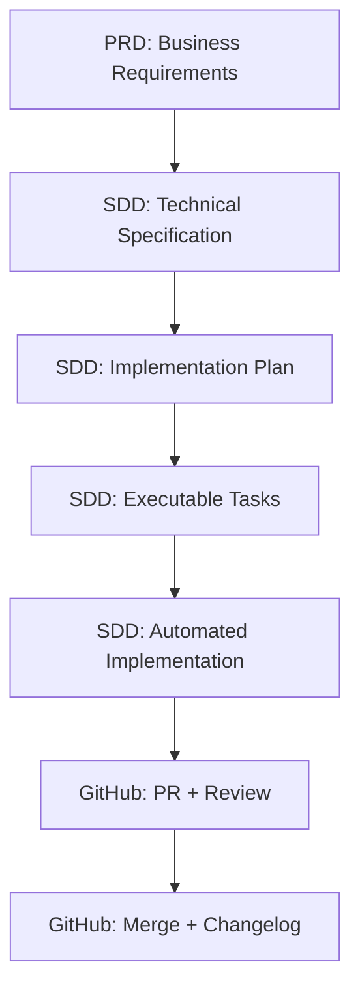

# Workflow AI-First

_Guía del ecosistema PRD → SDD → GitHub_

---

## 🎯 Arquitectura del Ecosistema

El ecosistema opera en 3 capas integradas:

```
📋 PRD-cycle (Business Layer)
   ↓ Define WHAT to build
🏗️ SDD-cycle (Engineering Layer)
   ↓ Define HOW to build
🔄 git-github (Delivery Layer)
   ↓ Tracks and delivers
```

### Flujo Completo



---

## 📦 Setup Worktree

### Con SDD Tracking (features)

```bash
/SDD-cycle:specify "implement OAuth authentication"
# → Crea worktree: ../feature-001-implement-oauth/
# → Abre IDE en nueva ventana
# ⚠️ CRÍTICO: Cmd+` para abrir terminal integrado y verificar pwd
```

### Ad-hoc (fixes rápidos)

```bash
/git-github:worktree:create "fix-payment-bug" main
# → Crea worktree: ../worktree-fix-payment-bug/
# → Abre IDE en nueva ventana
# ⚠️ CRÍTICO: Cmd+` para abrir terminal y ejecutar /utils:session-start
```

**Verificación obligatoria**:

```bash
pwd          # DEBE mostrar: ../feature-XXX/ o ../worktree-XXX/
git branch   # DEBE mostrar: rama de feature (NO main/develop)
```

**Comportamiento según contexto**:

- Desde `main/develop`: `/SDD-cycle:specify` crea NUEVO worktree + rama
- Desde worktree existente: `/SDD-cycle:specify` usa rama ACTUAL (no crea worktree)
- Para feature independiente: regresar a `main` antes de ejecutar specify

---

## 🔄 Workflows

### Con PRD (features de negocio)

```bash
# === PRD (Business) ===
/PRD-cycle:prd-new <feature_name>
/PRD-cycle:prd-sync <feature_name>
# → Crea parent issue en GitHub

# === SDD (Engineering - SECUENCIAL OBLIGATORIO) ===
/SDD-cycle:specify --from-issue <issue_number>
/SDD-cycle:clarify   # OBLIGATORIO (detecta ambigüedades, actualiza spec)
/SDD-cycle:plan      # Genera research.md, data-model.md, contracts/, quickstart.md
/SDD-cycle:tasks     # Genera tasks.md con GitHub sub-issues integration
/SDD-cycle:analyze   # Valida consistencia cross-artifact
/SDD-cycle:implement # Ejecuta tasks.md (TDD + parallelization)

# === Delivery ===
/git-github:commit "all changes"
/git-github:pr develop
# → Security review automático (BLOCKING)
```

### Sin PRD (desarrollo directo)

```bash
# === SDD (Engineering - SECUENCIAL OBLIGATORIO) ===
/utils:understand    # Mapea arquitectura existente
/SDD-cycle:specify "Implement OAuth authentication"
/SDD-cycle:clarify   # OBLIGATORIO
/SDD-cycle:plan      # Genera research.md, data-model.md, contracts/, quickstart.md
/SDD-cycle:tasks     # Genera tasks.md
/SDD-cycle:analyze   # Valida consistencia
/SDD-cycle:implement # Ejecuta tasks.md

# === Delivery ===
/git-github:commit "all changes"
/git-github:pr develop
```

### Bug Fix Urgente

```bash
# === Setup ===
/git-github:worktree:create fix-bug main
# Verificar: pwd debe mostrar ../worktree-fix-bug/

# === Implementation ===
/utils:understand "specific problem"
/SDD-cycle:specify "fix bug description"
/SDD-cycle:clarify   # OBLIGATORIO
/SDD-cycle:plan
/SDD-cycle:tasks
/SDD-cycle:analyze
/SDD-cycle:implement

# === Delivery ===
/git-github:commit "fix: description"
/git-github:pr main
```

---

## 🔍 Findings & Agentes

### Después del PR

Security review automático genera findings por severidad:

- **CRITICAL**: Security vulnerabilities, architectural violations
- **HIGH**: Technical debt, missing error handling
- **MEDIUM**: Code quality, optimization opportunities

### Resolución

```bash
# 1. Analizar
/git-github:issue-manager <pr_number>

# 2. Resolver (manual o delegar a agente especialista)
/agent:security-reviewer        # Security audit
/agent:performance-engineer     # Performance optimization

# 3. Actualizar
/git-github:commit "fix: resolve findings"
git push
```

### Top Agentes

| Agente                  | Uso                                    |
| ----------------------- | -------------------------------------- |
| `security-reviewer`     | Security vulnerabilities, compliance   |
| `performance-engineer`  | Bottlenecks, resource optimization     |
| `code-quality-reviewer` | Technical debt prevention              |
| `backend-architect`     | API design, service architecture       |
| `frontend-developer`    | React/Vue components, state management |
| `database-optimizer`    | Query optimization, schema design      |

📖 Referencia completa: @agents-guide.md (45 agentes)

---

## 🔄 Post-Merge

```bash
# 1. Changelog
/utils:changelog <pr_number>

# 2. Cleanup worktree
/git-github:worktree:cleanup <worktree_name>
# → Triple cleanup (worktree/local/remote)
# → Regresa automáticamente a main

# 3. Docs (si necesario)
/utils:docs
```

---

## 💡 Tips

### DO

- ✅ Usar `/SDD-cycle:clarify` SIEMPRE
- ✅ Security review antes de PR (automático con `/git-github:pr`)
- ✅ Un PR por worktree
- ✅ Commits semánticos: `fix: Closes #77`
- ✅ Cleanup worktrees post-merge

### DON'T

- ❌ Saltarse `/SDD-cycle:clarify`
- ❌ Múltiples PRs para una feature
- ❌ Desarrollar en main/develop directamente
- ❌ Mergear sin security review aprobado
- ❌ Cambiar de rama dentro de worktree (crear nuevo worktree)

### Selección de Path

**PRD-cycle**: Features con stakeholders de negocio, aprobación de producto
**SDD-cycle directo**: Bug fixes, refactorings, features técnicas
**Worktree ad-hoc**: POCs rápidos, trabajo exploratorio sin tracking

---

## 📚 Referencia Rápida

### PRD-cycle (Business Layer)

| Comando               | Propósito                      |
| --------------------- | ------------------------------ |
| `/PRD-cycle:prd-new`  | Crear PRD minimalista          |
| `/PRD-cycle:prd-sync` | Sincronizar PRD a GitHub Issue |

### SDD-cycle (Engineering Layer - SECUENCIAL OBLIGATORIO)

| Comando                   | Propósito                                                     |
| ------------------------- | ------------------------------------------------------------- |
| `/SDD-cycle:specify`      | Crear especificación técnica                                  |
| `/SDD-cycle:clarify`      | Clarificar ambigüedades (OBLIGATORIO)                         |
| `/SDD-cycle:plan`         | Generar research.md, data-model.md, contracts/, quickstart.md |
| `/SDD-cycle:tasks`        | Generar tasks.md con GitHub sub-issues                        |
| `/SDD-cycle:analyze`      | Validación cross-artifact                                     |
| `/SDD-cycle:implement`    | Ejecutar tasks.md (TDD + parallelization)                     |
| `/SDD-cycle:constitution` | Actualizar constitución                                       |

### git-github (Delivery Layer)

| Comando                        | Propósito                              |
| ------------------------------ | -------------------------------------- |
| `/git-github:worktree:create`  | Crear worktree aislado                 |
| `/git-github:worktree:cleanup` | Cleanup triple (worktree/local/remote) |
| `/git-github:commit`           | Commits semánticos agrupados           |
| `/git-github:pr`               | Crear PR con security review           |
| `/git-github:issue-manager`    | Analizar issues/PRs                    |
| `/git-github:issue-sync`       | Sincronizar updates a GitHub           |

### utils (Utilidades)

| Comando                | Propósito                                 |
| ---------------------- | ----------------------------------------- |
| `/utils:session-start` | Análisis de contexto + issues activos     |
| `/utils:understand`    | Mapeo de arquitectura existente           |
| `/utils:changelog`     | Actualizar CHANGELOG.md                   |
| `/utils:docs`          | Análisis y actualización de documentación |

---

_Última actualización: 2025-10-07 | Ecosistema PRD-SDD-GitHub_
